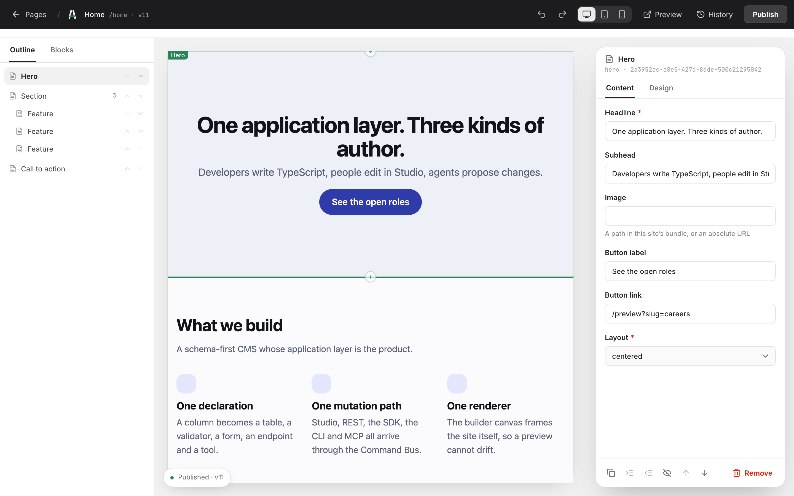
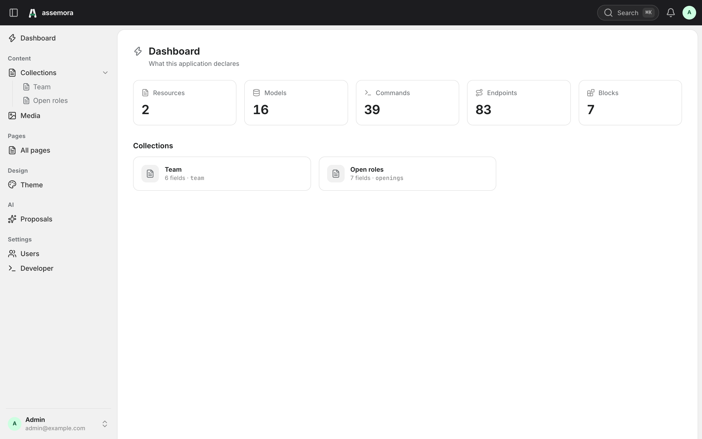
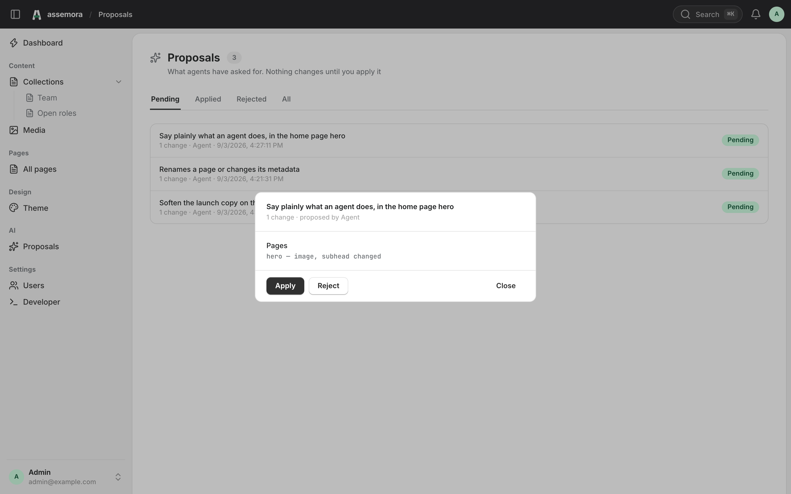

# Assemora

**An agent's write to your site is a change set a person reviews — produced by running
the real command and rolling it back, so the preview cannot disagree with the write it
predicts.**

[](https://github.com/assemora/assemora/actions/workflows/verify.yml)

Around that claim is a TypeScript framework and CMS with one application layer, which
the developer (TypeScript API), the person editing (Studio) and the AI agent (MCP) all
reach the same way. Every mutation is a command on one bus — validated, authorized,
transactional, revised and audited — and every command is already an MCP tool, so an
agent can be trusted with a site because the surface it touches is the one a person
uses, and its writes wait for a person.

> Build visually. Extend with TypeScript. Control with AI.



## Try it

Four commands, one process. It runs on an in-memory database, so there is nothing to
install and nothing to clean up.

```bash
git clone https://github.com/assemora/assemora.git
cd assemora
pnpm install
pnpm demo
```

That serves `examples/company` — a small site with three pages, seven block types, two
resources and a theme — and prints where everything is:

```text
listening on http://127.0.0.1:3000
  studio   http://127.0.0.1:3000/studio
  site     http://127.0.0.1:3000/preview
  public   http://127.0.0.1:3000/api/site/pages/home
```

Sign in as `admin@example.com`. The password is generated on the first boot and written
to `examples/company/.env`:

```bash
grep ASSEMORA_SEED_PASSWORD examples/company/.env
```

`pnpm dev` is the other one: the playground on `:4000` and Studio's own dev server on
`:5173`, which is how Studio itself is worked on.

## Status

Early, and published: every package is on npm at `0.1.0`, in lockstep, so
`pnpm create assemora` scaffolds a project that installs and `pnpm add assemora` fetches
the umbrella. The public API is still free to change before 1.0.
[`docs/releasing.md`](docs/releasing.md) is the procedure — `pnpm release <version>`.

All ten phases are complete. The scaffolder itself runs, and
`tests/integration/v1.test.ts` asserts the database schema, the REST CRUD, Studio,
OpenAPI, the API Explorer, the typed SDK and the MCP server rather than taking any of
them on trust (SPEC.md §124). What it cannot yet do is install what it wrote.

The guide is [`docs/guide/`](docs/guide/), and `apps/docs` renders it. The full
specification is [`SPEC.md`](SPEC.md), and decisions already taken live in
[`docs/adr/`](docs/adr/).

| Package | What it is |
| --- | --- |
| `@assemora/schema` | The primitives every layer reads. No dependencies, ever |
| `@assemora/core` | Command Bus, Query Bus, Schema Registry, events, context |
| `@assemora/database` | The Query AST and the adapter contract |
| `@assemora/data` | `model()`, the column DSL, the query builder, relations |
| `@assemora/database-postgres` | The AST executed. Drizzle lives here and nowhere else |
| `@assemora/resources` | A model as content: fields, filters, generic CRUD |
| `@assemora/http` | `route()`, the Fastify adapter, generated endpoints |
| `@assemora/openapi` | OpenAPI 3.1 and the introspection endpoint |
| `@assemora/sdk` | The typed client, generated from the registry |
| `@assemora/auth` | Users, roles, permissions, policies, tokens, agents |
| `@assemora/pages` | Pages as block trees, and every edit as a command |
| `@assemora/revisions` | History, diff, restore, undo and redo |
| `@assemora/media` | The media library and its storage drivers |
| `@assemora/react` | The renderer a site ships, and the builder canvas runs |
| `@assemora/audit` | What happened, who did it, and how it ended |
| `@assemora/change-sets` | What an agent proposed, previewed and not yet applied |
| `@assemora/mcp` | Every command and query, as a tool, generated from the registry |
| `@assemora/theme` | The theme as tokens, and the stylesheet they render to |
| `@assemora/notifications` | What an application announces, to whom, over which channel |
| `@assemora/queue-bullmq` | Jobs on Redis: the queue port of SPEC.md §82, implemented |
| `@assemora/plugin` | A module an npm package ships, and what the registry says it added |
| `@assemora/cli` | The `assemora` executable: generators, migrations, introspection |
| `assemora` | The umbrella: one call assembles all of the above (SPEC.md §9) |
| `create-assemora` | The scaffolder behind `pnpm create assemora my-project` |

Studio (`apps/studio`) is a client of that layer and holds no list of collections,
no hand-written form and no list of block types: it asks the Schema Registry what
exists and renders that. `apps/playground` is the reference application it is
developed against.



Every number and every card on the first screen is read from the Schema Registry. Add
`resource(Dish, …)` to the application and it appears here, in the sidebar, in the
command palette and in the API Explorer, with no edit to Studio.



An agent proposes and a person decides. That row was made over MCP, by a tool call that
wrote nothing: the line under it is read off a diff produced by running the command for
real and rolling the transaction back, so a preview cannot disagree with the write it
predicts. `docs/media/README.md` has the two requests that produce it.

```ts
export const User = model('users', {
  id: uuid().primary().defaultRandom(),
  email: string().unique(),
  active: boolean().default(true),
  posts: hasMany(() => Post, { foreignKey: 'authorId' }),
})

const users = await User.where('active', true).with('posts').latest().take(10)
```

```ts
route.post('/auth/login', {
  body: { email: email(), password: string().min(8) },
  response: { token: string() },
  handler: async ({ body }) => ({ token: await login(body) }),
})
```

That one declaration validates the request, types the handler, serializes the answer,
and appears in the Schema Registry, in `/api/openapi.json`, in the API Explorer and
in the generated SDK — with no second schema anywhere.

One model declaration gives the record type, the column metadata, the query entry
point and the model's scopes. Field names, values, enums and relation names are checked at
compile time, and the builder produces a Query AST rather than touching any
adapter's query API. The same query runs against the in-memory adapter and against
PostgreSQL without changing a character.

Dependency graph review:
[`docs/architecture/package-graph.md`](docs/architecture/package-graph.md).

```ts
export default assemora({
  database: postgres({ url: process.env.DATABASE_URL }),
  modules: [auth(), pages({ blocks }), media(), blog()],
  studio: true,
  api: true,
  mcp: true,
})
```

That is the whole application file. The umbrella is the one package allowed to depend
on everything, because it is the one nothing depends on — and it holds wiring rather
than behaviour, including the routes `auth`, `media` and `mcp` are forbidden to
declare themselves.

An agent reaches the same application through MCP, and every registered command and
query is already a tool — nobody maintains a list. A mutation tool does not mutate:
it previews the command, stores a change set, and hands back the diff. Production
state changes when a person applies it.

```text
assemora.blocks.update  →  { status: 'pending', changes: [{ summary: 'hero — subtitle changed', … }] }
```

The seven checks of SPEC.md §76 are not reimplemented for agents. A tool call is the
same bus call Studio makes, so it passes the same validation, permissions, policies,
field permissions and audit.

## Talk to it from Claude

Two commands. The first creates the identity an agent connects as — a session is
somebody, and an anonymous one reaches every tool with no permissions at all:

```bash
pnpm assemora agents:create "Content agent" \
  --permissions pages.read,blocks.update,changesets.propose \
  --actor <your user id> --write-mcp-json
```

It prints the token once, writes it into `.env`, and writes the `.mcp.json` a client
reads — which holds no credential of its own:

```json
{
  "mcpServers": {
    "content-agent": {
      "command": "pnpm",
      "args": ["assemora", "mcp"],
      "cwd": "/path/to/my-project"
    }
  }
}
```

`assemora mcp` is the server the client starts: the same generated tools over stdin and
stdout, which is the transport Claude Code, Claude Desktop and Cursor speak. The HTTP
endpoint is the other way in, for a client that prefers it — `POST /api/mcp`, with
`GET` answering 405 because this server pushes nothing.

Then the loop, as an agent sees it:

```text
assemora.describe        →  { models: […], resources: […], commands: […], policies: […] }
assemora.pages.get       →  { slug: 'home', tree: { blocks: [{ type: 'hero', … }] } }
assemora.blocks.update   →  { status: 'pending',
                              changes: [{ summary: 'hero — subtitle changed', … }] }
                            nothing has changed yet
assemora.changesets.propose  ← several commands, under a name the agent chose
                            a person opens Proposals, reads the diff, and applies it
```

Every line of that runs in CI. [`tests/integration/agent-e2e.test.ts`](tests/integration/agent-e2e.test.ts)
is the scenario of SPEC.md §97 over real JSON-RPC, and
[`tests/integration/mcp-transport.test.ts`](tests/integration/mcp-transport.test.ts)
connects with the MCP SDK's own client rather than with curl.

## How it compares

Payload, Strapi and Directus each ship an MCP server now, and each one is a good piece
of work. The difference is what a tool call *does*. Theirs writes — through the
project's own permissions, hooks and, where it exists, draft state. Assemora's proposes:
the command runs for real inside a transaction, the transaction is rolled back, and what
is stored is the diff, for a person to apply or reject. There is no second code path
for the preview, so it cannot lie, and a proposal written against a page that has since
changed is refused rather than applied over the top (`docs/adr/0019` and `0020`).

The rest of the table is where Assemora loses today, stated plainly.

| | Assemora | Payload 3 | Strapi 5 | Directus |
| --- | --- | --- | --- | --- |
| What an agent's write does | Stores a change set a person applies; previewed by executing and rolling back | Writes directly; access rules and hooks apply | Writes directly; a draft where Draft & Publish is on, then a `publish` tool | Writes directly through the user's permissions; delete protection is opt-in |
| Where the MCP tools come from | Generated from the Schema Registry: one per command and query, nobody keeps a list | Official plugin generates find, create, update, delete per collection | Built in: list, get, create, update, delete, publish, unpublish per content type | Official server |
| One schema declaration feeds | Types, validation, database, Studio, OpenAPI, SDK and MCP | Types, REST, GraphQL, admin | Types, REST, GraphQL, admin | Introspected from the database |
| Pages | A block tree, never HTML, with undo and redo; the theme is tokens and nothing accepts CSS | Blocks field with live preview | Dynamic zones | Not a page builder |
| Databases | PostgreSQL only | PostgreSQL, MongoDB, SQLite | PostgreSQL, MySQL, MariaDB, SQLite | PostgreSQL, MySQL, MariaDB, SQLite, MS SQL, Oracle, CockroachDB |
| GraphQL | No | Yes | Yes, as a plugin | Yes |
| Realtime | No | No | No | WebSockets and GraphQL subscriptions |
| License | Apache-2.0 | MIT | MIT | Source-available (MSCL); free below $5M revenue and 50 employees |
| On npm | Not yet | Yes | Yes | Yes |

As of September 2026, read from each project's own documentation:
[Payload](https://payloadcms.com/docs/plugins/mcp),
[Strapi](https://docs.strapi.io/cms/features/strapi-mcp-server),
[Directus](https://directus.com/docs/guides/ai/mcp). If a cell is out of date, a pull
request fixing it is welcome.

## Requirements

- Node.js 24 LTS
- pnpm 10

## Commands

```bash
pnpm install
pnpm verify        # boundaries + lint + build + typecheck + test + test:types
```

Individual steps: `pnpm boundaries`, `pnpm lint`, `pnpm format`, `pnpm build`,
`pnpm typecheck`, `pnpm test`, `pnpm test:types`.

`pnpm verify` is what CI runs, so a green checkout is a green pull request.

The PostgreSQL suite (`pnpm test:integration`) needs a database. It defaults to
`postgres://<user>@localhost:5432/assemora_test` and skips itself when nothing is
reachable, so a checkout without PostgreSQL still passes `pnpm verify`. Point it
elsewhere with `ASSEMORA_TEST_DATABASE_URL`. CI stands a real PostgreSQL up and sets
`ASSEMORA_REQUIRE_POSTGRES=1`, which turns an unreachable database into a failure
rather than a silent skip.

## Layout

```text
packages/     24 framework packages with fixed boundaries
apps/         studio/, playground/, docs/
starters/     bare — what `create-assemora` writes; nextjs — Assemora behind Next
examples/     blog — relations, scopes, policies; company — the block tree and a theme
docs/         guide/, architecture/, adr/, rules/
scripts/      boundary checker and hooks
```

A generated project needs one process, not two: `assemora()` serves Studio at
`/studio` beside its own API, on one origin, so the session cookie is first-party.
This repository runs them apart because Studio is rebuilt beside the playground.

Two processes are needed to look at Studio:

```bash
pnpm --filter @assemora/playground dev   # the application, on :4000
pnpm --filter @assemora/studio dev       # Studio, on :5173, proxying /api
```

The playground seeds itself on first boot and signs in with `ada@assemora.dev`.

## Package boundaries

Dependency direction is declared in `scripts/lib/package-graph.ts` and enforced by
`pnpm boundaries`. A new edge between packages requires three consistent edits
(`package.json`, `tsconfig.build.json`, the policy) and a new ADR.

## Language

Everything in this repository is written in English — code, comments, documentation
and commit messages.

## Contributing

[`CONTRIBUTING.md`](CONTRIBUTING.md) — how to get set up, and the rules a change is
held to. [`CODE_OF_CONDUCT.md`](CODE_OF_CONDUCT.md) applies everywhere the project
is discussed. Security reports go through [`SECURITY.md`](SECURITY.md), privately.

## License

[Apache-2.0](LICENSE).
